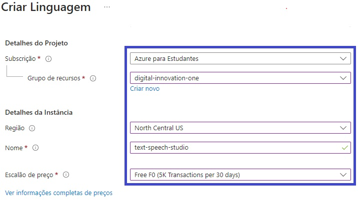

    
        
        <h1 style="margin: 0; text-shadow: 2px 2px 3px #888;">Microsoft Azure AI Fundamentals</h1>
    

 

    <h2 style="margin: 0; text-shadow: 2px 2px 3px #888; font-family: 'Helvetica', sans-serif; text-decoration: none;">
Laboratório: Analise texto com Language Studio</h2>

    

               <h4 style="margin: 0; text-shadow: 2px 2px 3px #888; font-family: 'Raleway', sans-serif;">I ❤️ Front-End Development!</h4>
    

<h3>Encontre-me :handshake: </h3> 

    
    
    
</a>
    
    
    

 

---

### Menu
- [Introdução :pushpin:](#introdução-pushpin)
- [Desenvolvimento :gear:](#desenvolvimento-gear)
- [Etapa 1: Crie um recurso de idioma :performing\_arts:](#etapa-1-crie-um-recurso-de-idioma-performing_arts)
- [Etapa 2: Configure seu recurso no Azure AI Language Studio :framed\_picture:](#etapa-2-configure-seu-recurso-no-azure-ai-language-studio-framed_picture)
- [Etapa 3: Analise avaliações no Language Studio :dart:](#etapa-3-analise-avaliações-no-language-studio-dart)
- [Licença :traffic\_light:](#licença-traffic_light)
- [Agradecimentos :tada:](#agradecimentos-tada)

## Introdução :pushpin:

Bem-vindo ao laboratório: Analise texto com Language Studio!

Neste exercício, exploraremos os recursos da linguagem Azure AI ao analisar exemplos de avaliações de hotéis no Language Studio. O Processamento de Linguagem Natural (PNL), um ramo da IA, lida com linguagem escrita e falada, permitindo construir soluções para extrair significado semântico de texto ou fala, e formular respostas naturais.

Imagine a agência de viagens fictícia Margie's Travel incentivando clientes a enviar avaliações de estadias em hotéis. Utilizando o serviço de idiomas, é possível identificar frases-chave, determinar se as avaliações são positivas ou negativas, e analisar o texto em busca de menções a entidades conhecidas, como locais ou pessoas.

O Azure AI Language Service oferece análise de texto e recursos de PNL, incluindo identificação de frases-chave e classificação de texto com base no sentimento.

## Desenvolvimento :gear:

O desenvolvimento no Azure Language Studio abrange a implementação de avançados recursos de Processamento de Linguagem Natural (PNL). Isso possibilita a análise de texto, identificação de frases-chave e classificação de texto com base no sentimento. Ao utilizar o Language Studio, é possível construir soluções que extraem significado semântico de texto ou fala, facilitando a compreensão, identificação de padrões e análise de conteúdo em diversas aplicações.

## Etapa 1: Crie um recurso de idioma :performing_arts:

1. Em uma nova guia do navegador, acesse o portal do Azure por meio do link <a href="https://portal.azure.com">portal.azure.com</a>, utilizando a conta da Microsoft associada à sua assinatura do Azure.

2. Prossiga clicando no botão ＋Criar um recurso e realize uma busca por "Serviço de Idioma". Escolha a opção de criar um plano de serviço de idiomas. Isso o direcionará para uma página onde poderá selecionar recursos adicionais. Mantenha as configurações padrão selecionadas e clique em "Continuar" para criar o seu recurso.

3. Ao chegar na página de criação do Serviço de Idioma, configure-o com as seguintes especificações:

    - _**Assinatura**_: sua assinatura do Azure.
  
    - _**Grupo de recursos**_: selecione ou crie um grupo de recursos - com um nome exclusivo.
  
    - _**Região**_: Leste dos EUA.
  
    - _**Nome**_: Insira um nome exclusivo.
  
    - _**Nível de preços**_: F0 grátis ou S se F0 grátis não estiver - disponível
  
    - _**Ao marcar esta caixa, confirmo que li e compreendi todos os - termos abaixo:**_ Selecionado.

1. Selecione **Revisar** + **criar** e depois **Criar** e aguarde a conclusão da implantação.

...

## Etapa 2: Configure seu recurso no Azure AI Language Studio :framed_picture:

1. Em uma nova guia do navegador, acesse o Language Studio por meio do link <a href="https://language.cognitive.azure.com">language.cognitive.azure.com</a> faça login.

2. Ao ser solicitado em "Select an Azure resource", realize as seguintes configurações:

     - _**Diretório do Azure**_: diretório padrão, o diretório que você está usando.
  
     - A_**ssinatura do Azure**_: selecione a assinatura que você está usando.
  
     - _**Tipo de recurso**_: Idioma
  
     - _**Nome do recurso**_: selecione o recurso de serviço de idioma que você acabou de criar.
  
     - Em seguida, selecione Concluído.
  
 
...

## Etapa 3: Analise avaliações no Language Studio :dart:

1. Acesse o **Language Studio** por meio de um navegador web, utilizando o link <a href="https://language.cognitive.azure.com">language.cognitive.azure.com<a/>.

2. Na página inicial intitulada **"Bem-vindo ao Language Studio"**, clique na guia "Classificar texto".

3. Em seguida, escolha a opção "Analisar sentimento e extrair opiniões".

4. No campo "Selecionar idioma do texto", escolha a opção "Inglês" caso seja o idioma do seu texto.

5. Em "Selecionar seu recurso do Azure", opte pelo seu recurso específico.

6. Na seção "Digite seu próprio texto, carregue um arquivo ou use um de nossos textos de exemplo", realize a cópia e cole da seguinte revisão:

7. Este tambem: Marque a caixa para confirmar que a demonstração incorrerá em uso e poderá incorrer em custos e selecione Executar .

8. Revise a saída. Observe que o documento é analisado quanto ao sentimento, assim como cada frase . Selecione Frase 1 para mostrar a análise de sentimento dessa frase.

...

---

## Licença :traffic_light:
Este projeto está licenciado sob a Licença consulte o arquivo 
 [MIT](https://opensource.org/licenses/MIT).

## Agradecimentos :tada:

_**Digital Innovation One**_ 

Agradeço à Digital Innovation One por proporcionar recursos educacionais valiosos que contribuíram para o desenvolvimento dos meus projetos.

 

_**Azure**_

Expresso minha gratidão à equipe do Microsoft Azure por oferecer uma plataforma robusta e escalável para hospedar e gerenciar aplicativos em nuvem. A eficiência e confiabilidade do Azure são fundamentais para o sucesso de muitos projetos.

_**VS Code**_

Agradeço à equipe do Visual Studio Code pelo incrível editor que facilita o desenvolvimento deste projeto.

_**Microsoft**_

Agradeço à equipe da Microsoft por suas contribuições inovadoras para o mundo da tecnologia. Sua dedicação ao desenvolvimento de software e serviços tem impactado positivamente a comunidade global de desenvolvedores.

_**GitHub**_ 

Agradeço à equipe do GitHub por fornecer uma plataforma de desenvolvimento colaborativo que facilita o compartilhamento de projetos.

Copyright © 2024 / RenatoMor

