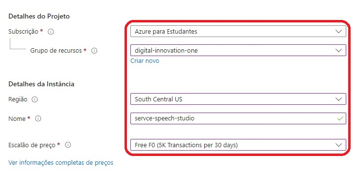
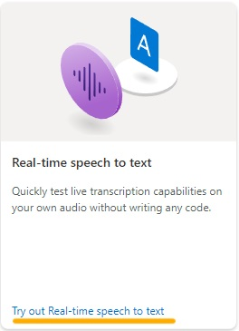
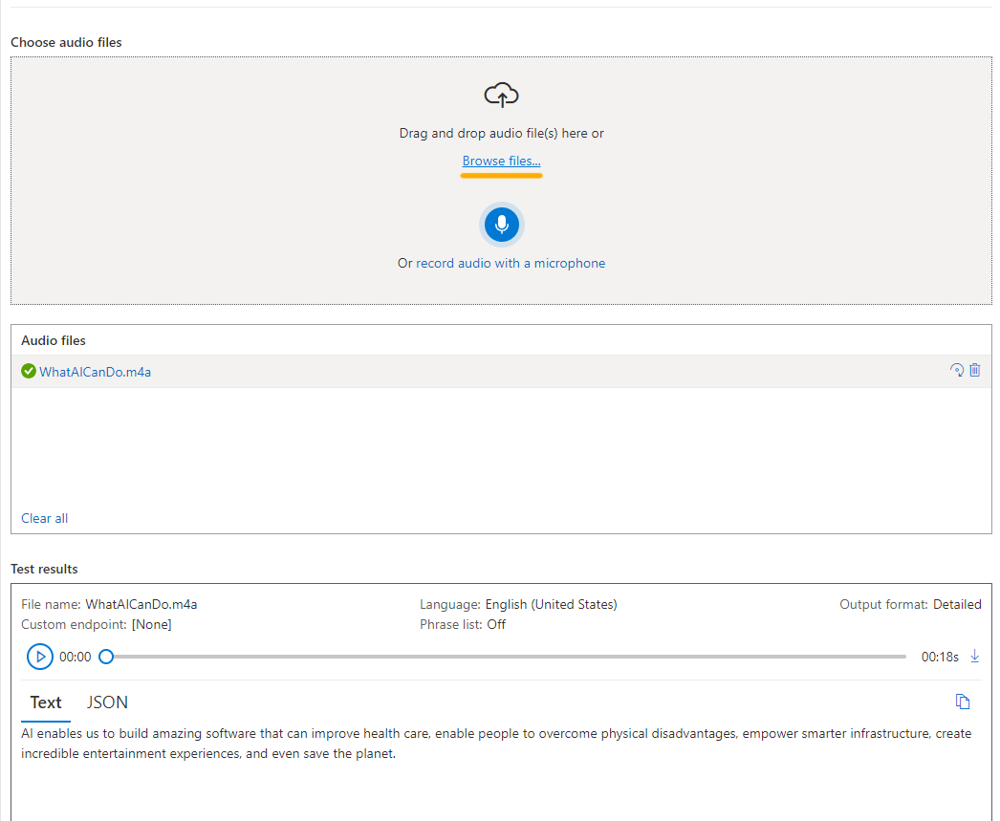

    
        
        <h1 style="margin: 0; text-shadow: 2px 2px 3px #888;">Microsoft Azure AI Fundamentals</h1>
    

 

    <h2 style="margin: 0; text-shadow: 2px 2px 3px #888; font-family: 'Helvetica', sans-serif; text-decoration: none;">
Laboratório: Analise sentimentos com Language Studio</h2>

    

               <h4 style="margin: 0; text-shadow: 2px 2px 3px #888; font-family: 'Raleway', sans-serif;">I ❤️ Front-End Development!</h4>
    

<h3>Encontre-me :handshake: </h3> 

    
    
    
</a>
    
    
    

 

---

### Menu
- [Introdução :pushpin:](#introdução-pushpin)
- [Desenvolvimento :gear:](#desenvolvimento-gear)
- [Etapa 1: Configurações :performing\_arts:](#etapa-1-configurações-performing_arts)
- [Etapa 2: Explore a fala em texto no Speech Studio :framed\_picture:](#etapa-2-explore-a-fala-em-texto-no-speech-studio-framed_picture)
- [Etapa 3: Transformar audio em texto :dart:](#etapa-3-transformar-audio-em-texto-dart)
- [Licença :traffic\_light:](#licença-traffic_light)
- [Agradecimentos :tada:](#agradecimentos-tada)

## Introdução :pushpin:

Bem-vindo ao laboratório: Explorando o Studio de Fala!

O Azure AI Speech oferece a capacidade de transformar discurso em texto e vice-versa, proporcionando uma variedade de aplicações. Com essa poderosa ferramenta, é possível desenvolver aplicativos capazes de transcrever notas de reuniões ou gerar texto a partir de gravações de entrevistas.

No contexto deste exercício, você terá a oportunidade de explorar as funcionalidades do Azure AI Speech Studio. Ao se envolver com este serviço, você poderá aprimorar suas habilidades na integração de tecnologias de processamento de linguagem natural, abrindo caminho para aplicações inovadoras e eficientes no campo da inteligência artificial.

## Desenvolvimento :gear:

Para usufruir dos benefícios do serviço de Fala, é possível iniciar criando um recurso dedicado de Fala ou utilizar um recurso preexistente dos serviços de IA do Azure.

Durante este exercício, será abordado o processo de criação de um recurso específico para AI Speech, a menos que já esteja em posse de um recurso que atenda às suas necessidades. Este procedimento proporcionará uma compreensão mais aprofundada sobre as configurações e opções disponíveis, permitindo uma personalização mais precisa de acordo com os requisitos do projeto em questão. Esteja pronto para explorar as nuances do Azure AI Speech e otimizar a implementação para obter resultados eficientes e adaptados às suas demandas específicas.

## Etapa 1: Configurações :performing_arts:

1. Em outra guia do navegador, abra o <a href="https://speech.microsoft.com/portal">Azure AI Speech Studio</a>  , entrando com sua conta da Microsoft.

2. Selecione **Configurações** e depois **Crie um recurso**. Configure-o com as seguintes configurações:

   - **_Nome do novo recurso_**: Insira um nome exclusivo.
  
   - **_Assinatura_** : sua assinatura do Azure.
  
   - **_Região_**: Selecione uma região suportada.
  
   - **_Nível de preços_**: FO gratuito (se disponível, caso contrário, selecione Padrão S0).
    
   - **_Grupo de recursos_**: selecione ou crie um grupo de recursos com um nome exclusivo.
  
  

3. Selecione Criar recurso. Aguarde até que o recurso seja criado e selecione Usar recurso . A página Introdução à Fala é exibida.

...

## Etapa 2: Explore a fala em texto no Speech Studio :framed_picture:

1. Selecione <a href="https://aka.ms/mslearn-speech-files">https://aka.ms/mslearn-speech-files</a> para baixar o speech.zip.

2. O conteúdo da pasta é um arquivo de audio, será usado nesse exemplo. Extraia o arquivo.

3. Na página Introdução à fala, em Fala , localize Fala em tempo real para texto . Selecione **_Experimente a fala em tempo real para texto_** **(Real-time speech to text)**.

...

## Etapa 3: Transformar audio em texto :dart:

**Em Escolher arquivos de áudio, selecione Procurar arquivos e navegue até a pasta onde você salvou o arquivo. Selecione WhatAICanDo.m4a e depois Abrir.**

...

---

## Licença :traffic_light:
Este projeto está licenciado sob a Licença consulte o arquivo 
 [MIT](https://opensource.org/licenses/MIT).

## Agradecimentos :tada:

_**Digital Innovation One**_ 

Agradeço à Digital Innovation One por proporcionar recursos educacionais valiosos que contribuíram para o desenvolvimento dos meus projetos.

 

_**Azure**_

Expresso minha gratidão à equipe do Microsoft Azure por oferecer uma plataforma robusta e escalável para hospedar e gerenciar aplicativos em nuvem. A eficiência e confiabilidade do Azure são fundamentais para o sucesso de muitos projetos.

_**VS Code**_

Agradeço à equipe do Visual Studio Code pelo incrível editor que facilita o desenvolvimento deste projeto.

_**Microsoft**_

Agradeço à equipe da Microsoft por suas contribuições inovadoras para o mundo da tecnologia. Sua dedicação ao desenvolvimento de software e serviços tem impactado positivamente a comunidade global de desenvolvedores.

_**GitHub**_ 

Agradeço à equipe do GitHub por fornecer uma plataforma de desenvolvimento colaborativo que facilita o compartilhamento de projetos.

Copyright © 2024 / RenatoMor

